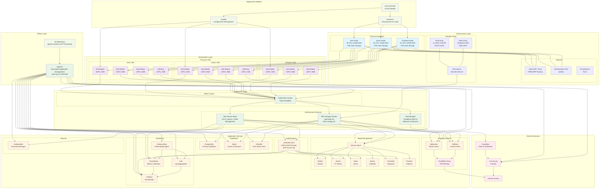

```mermaid
graph TB
    subgraph "Infrastructure Layer"
        direction TB
        subgraph "Physical Hardware"
            A[Alvin Node<br/>20 CPU, 64GB RAM<br/>2TB Ceph Storage]
            S[Simon Node<br/>20 CPU, 64GB RAM<br/>2TB Ceph Storage]
            T[Theodore Node<br/>20 CPU, 64GB RAM<br/>2TB Ceph Storage]
        end
        
        subgraph "Network"
            N1[10Gb SFP+ Ports<br/>FRR/OSPF Routing]
            N2[1Gb Bonded LACP<br/>Uplinks]
            N3[Thunderbolt 4<br/>Ports]
        end
        
        subgraph "Storage Arrays"
            V[Vault Array<br/>2x vdevs 4x16TB<br/>Flash Cache]
            F[Flash Array<br/>Enterprise SSD<br/>High IOPS]
            NFS[NFS Server<br/>192.168.103.114]
        end
    end
    
    subgraph "Virtualization Layer"
        direction TB
        subgraph "Proxmox VMs"
            subgraph "Alvin VMs"
                AM[K8s Master<br/>2CPU, 4GB]
                AW1[K8s Worker<br/>4CPU, 8GB]
                AW2[K8s Worker<br/>4CPU, 8GB]
                AH[HAProxy<br/>1CPU, 2GB]
            end
            
            subgraph "Simon VMs"
                SM[K8s Master<br/>2CPU, 4GB]
                SW1[K8s Worker<br/>4CPU, 8GB]
                SW2[K8s Worker<br/>4CPU, 8GB]
                SH[HAProxy<br/>1CPU, 2GB]
            end
            
            subgraph "Theodore VMs"
                TM[K8s Master<br/>2CPU, 4GB]
                TW1[K8s Worker<br/>4CPU, 8GB]
                TW2[K8s Worker<br/>4CPU, 8GB]
            end
        end
    end
    
    subgraph "Kubernetes Layer"
        direction TB
        subgraph "RKE2 Cluster"
            K8S[Kubernetes Cluster<br/>High Availability]
        end
        
        subgraph "Infrastructure Services"
            ISTIO[Istio Service Mesh<br/>mTLS, Ingress, Traffic Management]
            CERT[Cert-Manager<br/>Cloudflare DNS-01<br/>Wildcard Certificates]
            STORAGE[NFS Storage Classes<br/>vault-data-nfs<br/>flash-configs-nfs]
        end
    end
    
    subgraph "GitOps Layer"
        direction TB
        GIT[Git Repository<br/>github.com/MrCurlsTTV/homelab]
        ARGO[ArgoCD<br/>Declarative Application Management<br/>Auto-sync & Self-heal]
    end
    
    subgraph "Application Services"
        direction TB
        subgraph "Authentication"
            AUTH[Authentik SSO<br/>OIDC/LDAP Provider<br/>auth.mrcurls.org]
        end
        
        subgraph "Media Management"
            SERVARR[Servarr Stack]
            RADARR[Radarr<br/>Movies]
            SONARR[Sonarr<br/>TV Shows]
            LIDARR[Lidarr<br/>Music]
            BAZARR[Bazarr<br/>Subtitles]
            OVERSEERR[Overseerr<br/>Requests]
            PROWLARR[Prowlarr<br/>Indexers]
        end
        
        subgraph "Download Clients"
            QB[Qbittorrent<br/>Torrent Client]
            NZB[NZBGet<br/>Usenet Client]
            CF[Cloudflare Proxy<br/>VPN Routing]
        end
        
        subgraph "Databases"
            PSQL[PostgreSQL<br/>Primary Database]
            REDIS[Redis<br/>Cache & Sessions]
            INFLUX[InfluxDB<br/>Time Series Data]
        end
        
        subgraph "Monitoring"
            PROM[Prometheus<br/>Metrics Collection]
            GRAF[Grafana<br/>Visualization]
            LOKI[Loki<br/>Log Aggregation]
            ALLOY[Grafana Alloy<br/>Observability Agent]
        end
        
        subgraph "Security"
            VAULT[Vaultwarden<br/>Password Manager]
        end
    end
    
    subgraph "External Services"
        direction TB
        CLOUDFLARE[Cloudflare<br/>DNS & Certificates]
        DOMAIN[mrcurls.org<br/>Domain]
        INTERNET[Internet Access]
    end
    
    subgraph "Deployment Pipeline"
        direction TB
        AZURE[Azure DevOps<br/>CI/CD Pipeline]
        TERRAFORM[Terraform<br/>Infrastructure as Code]
        ANSIBLE[Ansible<br/>Configuration Management]
    end
    
    %% Physical connections
    A --- N1
    S --- N1
    T --- N1
    A --- N2
    S --- N2
    T --- N2
    
    %% Storage connections
    V --- NFS
    F --- NFS
    
    %% VM deployments
    A --> AM
    A --> AW1
    A --> AW2
    A --> AH
    S --> SM
    S --> SW1
    S --> SW2
    S --> SH
    T --> TM
    T --> TW1
    T --> TW2
    
    %% Kubernetes cluster
    AM --> K8S
    SM --> K8S
    TM --> K8S
    AW1 --> K8S
    AW2 --> K8S
    SW1 --> K8S
    SW2 --> K8S
    TW1 --> K8S
    TW2 --> K8S
    
    %% Infrastructure services
    K8S --> ISTIO
    K8S --> CERT
    K8S --> STORAGE
    NFS --> STORAGE
    
    %% GitOps flow
    GIT --> ARGO
    ARGO --> K8S
    
    %% Application deployments
    ARGO --> AUTH
    ARGO --> SERVARR
    ARGO --> QB
    ARGO --> NZB
    ARGO --> PSQL
    ARGO --> REDIS
    ARGO --> INFLUX
    ARGO --> PROM
    ARGO --> GRAF
    ARGO --> LOKI
    ARGO --> ALLOY
    ARGO --> VAULT
    
    %% Service mesh
    ISTIO --> AUTH
    ISTIO --> SERVARR
    ISTIO --> QB
    ISTIO --> NZB
    ISTIO --> GRAF
    ISTIO --> PROM
    ISTIO --> VAULT
    
    %% Servarr components
    SERVARR --> RADARR
    SERVARR --> SONARR
    SERVARR --> LIDARR
    SERVARR --> BAZARR
    SERVARR --> OVERSEERR
    SERVARR --> PROWLARR
    
    %% Authentication flow
    AUTH --> RADARR
    AUTH --> SONARR
    AUTH --> LIDARR
    AUTH --> OVERSEERR
    AUTH --> GRAF
    AUTH --> PROM
    
    %% Download routing
    QB --> CF
    NZB --> CF
    CF --> INTERNET
    
    %% Certificate management
    CERT --> CLOUDFLARE
    CLOUDFLARE --> DOMAIN
    
    %% HAProxy load balancing
    AH --> DOMAIN
    SH --> DOMAIN
    
    %% Monitoring connections
    PROM --> GRAF
    LOKI --> GRAF
    ALLOY --> PROM
    ALLOY --> LOKI
    
    %% CI/CD Pipeline
    AZURE --> TERRAFORM
    AZURE --> ANSIBLE
    TERRAFORM --> A
    TERRAFORM --> S
    TERRAFORM --> T
    ANSIBLE --> AM
    ANSIBLE --> SM
    ANSIBLE --> TM
    
    %% Internet access
    DOMAIN --> INTERNET
    
    %% Storage usage
    STORAGE --> PSQL
    STORAGE --> REDIS
    STORAGE --> INFLUX
    STORAGE --> SERVARR
    STORAGE --> QB
    STORAGE --> NZB
    
    %% Styling
    classDef physicalNode fill:#e1f5fe
    classDef vmNode fill:#f3e5f5
    classDef k8sService fill:#e8f5e8
    classDef appService fill:#fff3e0
    classDef external fill:#ffebee
    classDef pipeline fill:#f1f8e9
    
    class A,S,T physicalNode
    class AM,SM,TM,AW1,AW2,SW1,SW2,TW1,TW2,AH,SH vmNode
    class K8S,ISTIO,CERT,STORAGE,ARGO k8sService
    class AUTH,SERVARR,RADARR,SONARR,LIDARR,BAZARR,OVERSEERR,PROWLARR,QB,NZB,PSQL,REDIS,INFLUX,PROM,GRAF,LOKI,ALLOY,VAULT appService
    class CLOUDFLARE,DOMAIN,INTERNET,CF external
    class AZURE,TERRAFORM,ANSIBLE,GIT pipeline
```